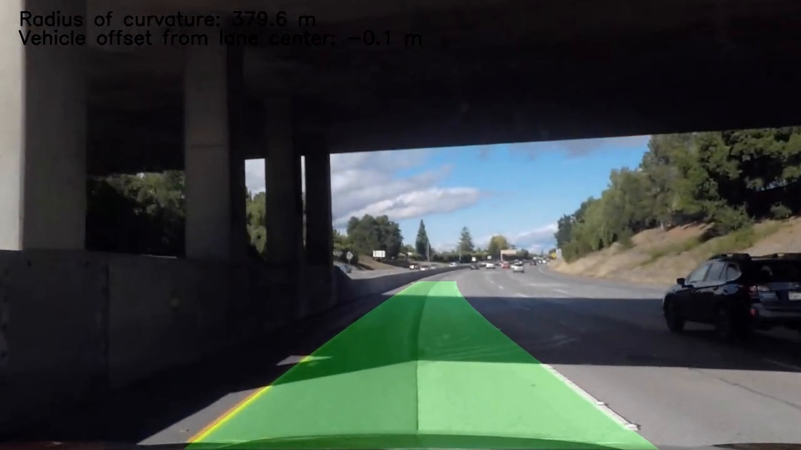
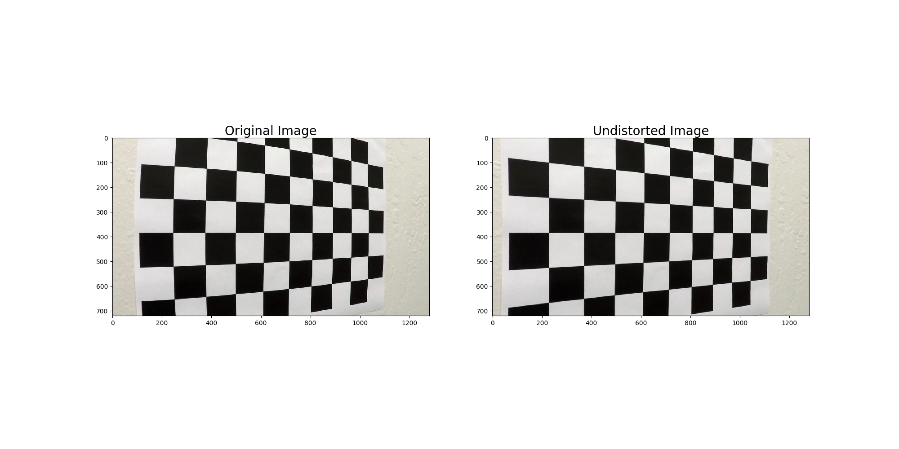
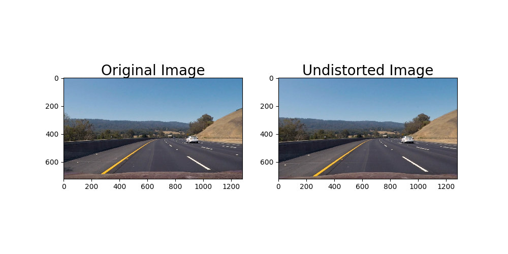
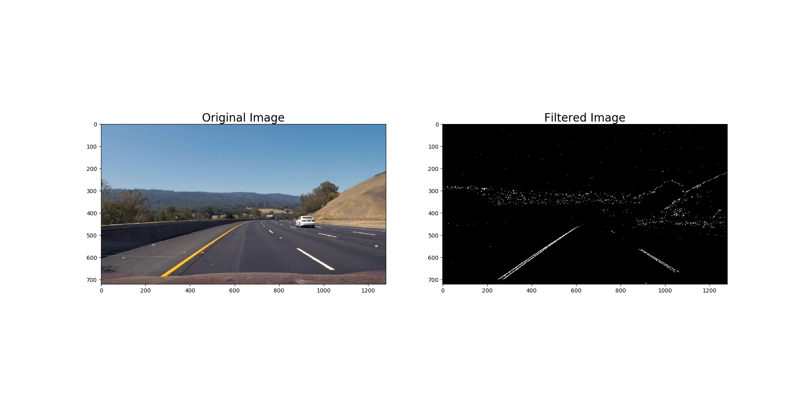
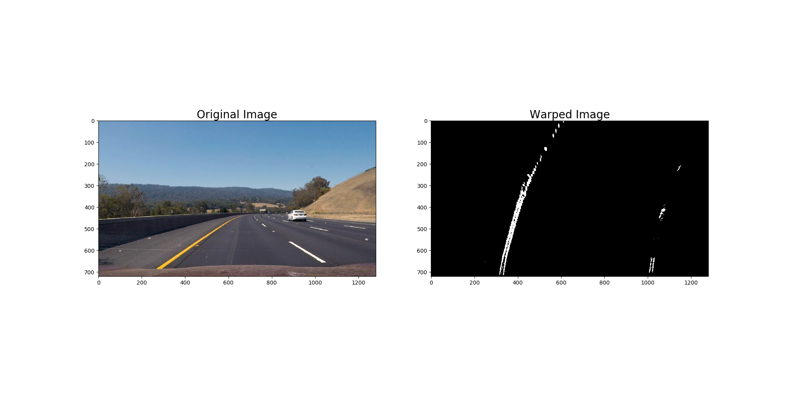
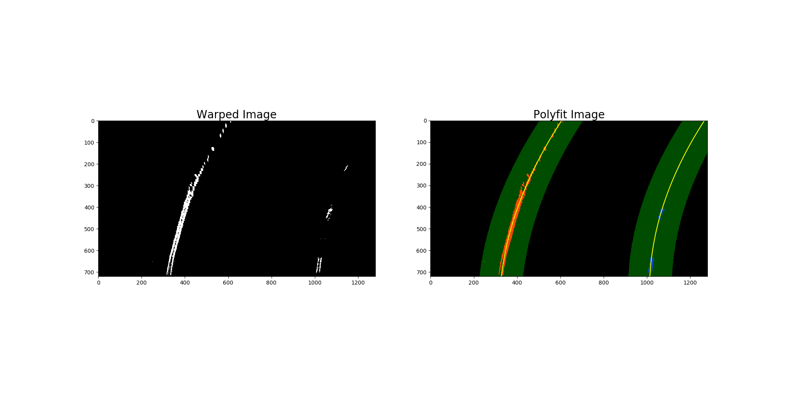
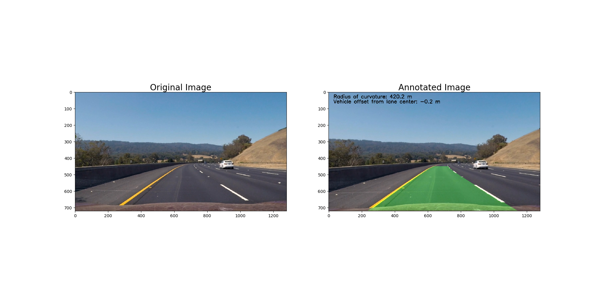

## Advanced Lane Finding

## The Project

The goal of this project is to identify the lane boundaries in a video using computer vision.
The steps of this project are the following:

* Compute the camera calibration matrix and distortion coefficients given a set of chessboard images.
* Apply a distortion correction to raw images.
* Use color transforms, gradients, etc., to create a thresholded binary image.
* Apply a perspective transform to rectify binary image ("birds-eye view").
* Detect lane pixels and fit to find the lane boundary.
* Determine the curvature of the lane and vehicle position with respect to center.
* Warp the detected lane boundaries back onto the original image.
* Output visual display of the lane boundaries and numerical estimation of lane curvature and vehicle position.

The images for camera calibration are stored in the folder called `camera_cal`.  The images in `test_images` are for testing the pipeline on single frames.  If you want to extract more test images from the videos, you can simply use an image writing method like `cv2.imwrite()`, i.e., you can read the video in frame by frame as usual, and for frames you want to save for later you can write to an image file.  

I saved the examples of the output from each stage of my pipeline in the folder called `output_images`, and included a description in my writeup for the project of what each image shows.    The video called `project_video.mp4` is the first video which my pipeline works well on it.  

The `challenge_video.mp4` video is an extra challenge which I tested on my pipeline under somewhat trickier conditions. My proposed pipline works on it, too. 

In this project, I used and improved the parts of this GitHub repo: https://github.com/georgesung/advanced_lane_detection. Compared to Georgesung, my code is more robust and can get good results for `challenge_video.mp4` (please see the output_video folder). Finally, please fell free and continue to develop this new code more and more. 

## Dependencies

* Python 3.5
* Numpy
* OpenCV-Python
* Matplotlib
* Pickle
* Glob

## How to run
Run `python line_fit_video.py`. This will take the raw video file at 'project_video.mp4', and create an annotated output video at 'out.mp4'. Afterwards, it will display an example annotated image on screen.
Please fell free to use your own vide instead of 'project_video.mp4' and check the output and save it with your own name if you like it.

## Camera calibration
The camera was calibrated using the chessboard images in 'camera_cal/*.jpg'. The following steps were performed for each calibration image:

* Convert to grayscale
* Find chessboard corners with OpenCV's `findChessboardCorners()` function, assuming a 9x6 board

After the above steps were executed for all calibration images, I used OpenCV's `calibrateCamera()` function to calculate the distortion matrices. Using the distortion matrices, I undistort images using OpenCV's `undistort()` function.

The following figures show two examples of undistorting image using camera calibration:

The final calibration matrices are saved in the pickle file 'calibrate_camera.p'

## Advanced Lane Detection Pipeline
The following describes and illustrates the steps involved in the advanced lane detection pipeline. I will use this image as an input for my pipeline and I refer it as INPUT for simplicity:

### Undistort image
Using the camera calibration matrices in 'calibrate_camera.p', we can undistort the input image. Below is the undistorted image of INPUT:

The code to perform camera calibration is in 'calibrate_camera.py'. For all images in 'test_images/\*.jpg', the undistorted version of that image is saved in 'output_images/02ـundistort_\*.png'.

### Thresholded binary image
The next step is to create a thresholded binary image, taking the undistorted image as input. The goal is to identify pixels that are likely to be part of the lane lines. In particular, I perform the following:

* Apply the following filters with thresholding, to create separate "binary images" corresponding to each individual filter
  * Absolute horizontal Sobel operator on the image
  * Sobel operator in both horizontal and vertical directions and calculate its magnitude
  * Sobel operator to calculate the direction of the gradient
  * Convert the image from RGB space to HLS space, and threshold the S channel
  * Convert the image from RGB space to HSV space, and threshold the H, S, and V channels
  * Convert the image from RGB space to Gray space, and threshold its magnitude.
  
* Combine the above binary images to create the final binary image

Here is the example image, transformed into a binary image by combining the above thresholded binary filters:

The code to generate the thresholded binary image is in 'combined_thresh.py', in particular the function `combined_thresh()`. For all images in 'test_images/\*.jpg', the thresholded binary version of that image is saved in 'output_images/03_CombinedThresh_\*.png'.

### Perspective transform
Given the thresholded binary image, the next step is to perform a perspective transform. The goal is to transform the image such that we get a "bird's eye view" of the lane, which enables us to fit a curved line to the lane lines (e.g. polynomial fit). An alternative to this is to "crop" an area of the original image that is most likely to have the lane line pixels.

To accomplish the perspective transform, we use OpenCV's `getPerspectiveTransform()` and `warpPerspective()` functions. I hard-code the source and destination points for the perspective transform. The source and destination points were visually determined by manual inspection, although an important enhancement would be to automatically determine these points.

Here is the example image, after applying perspective transform:

The code to perform perspective transform is in 'perspective_transform.py', in particular the function `perspective_transform()`. For all images in 'test_images/\*.jpg', the warped version of that image (i.e. post-perspective-transform) is saved in 'output_images/04_warped_\*.png'.

### Polynomial fit
Given the warped binary image from the previous step, I now fit a 2nd order polynomial to both left and right lane lines. In particular, I perform the following:

* Calculate a histogram of the bottom half of the image
* Partition the image into 9 horizontal slices
* Starting from the bottom slice, enclose a 200 pixel wide window around the left peak and right peak of the histogram (split the histogram in half vertically)
* Go up the horizontal window slices to find pixels that are likely to be part of the left and right lanes, recentering the sliding windows if the number of matched point are not enough
* Given 2 groups of pixels (left and right lane line candidate pixels), fit a 2nd order polynomial to each group, which represents the estimated left and right lane lines

The code to perform the above is in the `line_fit()` function of 'line_fit.py'.

Since our goal is to find lane lines from a video stream, we can take advantage of the temporal correlation between video frames.

Given the polynomial fit calculated from the previous video frame, one performance enhancement we can implement is to search +/- 100 pixels horizontally from the previously predicted lane lines. Then we simply perform a 2nd order polynomial fit to those pixels found from our quick search. In case we don't find enough pixels, we can return an error (e.g. `return None`), and the function's caller would ignore the current frame (i.e. keep the lane lines the same) and be sure to perform a full search on the next frame. Overall, this will improve the speed of the lane detector, useful if we were to use this detector in a production self-driving car. The code to perform an abbreviated search is in the `tune_fit()` function of 'line_fit.py'.

Another enhancement to exploit the temporal correlation is to smooth-out the polynomial fit parameters. The benefit to doing so would be to make the detector more robust to noisy input. I used a simple moving average of the polynomial coefficients (3 values per lane line) for the most recent 20 video frames. The code to perform this smoothing is in the function `add_fit()` of the class `Line` in the file 'Line.py'. The `Line` class was used as a helper for this smoothing function specifically, and `Line` instances are global objects in 'line_fit.py'.

Below is an illustration of the output of the polynomial fit, for our original example image. For all images in 'test_images/\*.jpg', the polynomial-fit-annotated version of that image is saved in 'output_images/05_polyfit_\*.png'.

### Radius of curvature
Given the polynomial fit for the left and right lane lines, we can calculate the radius of curvature for each line according to formulas presented [here](http://www.intmath.com/applications-differentiation/8-radius-curvature.php). We can also convert the distance units from pixels to meters, assuming 30 meters per 720 pixels in the vertical direction, and 3.7 meters per 700 pixels in the horizontal direction.

Finally, we average the radius of curvature for the left and right lane lines. This value is shown in the final video's annotation.

The code to calculate the radius of curvature is in the function `calc_curve()` in 'line_fit.py'.

### Vehicle offset from lane center
Given the polynomial fit for the left and right lane lines, we can calculate the vehicle's offset from the lane center. The vehicle's offset from the center is annotated in the final video. I made the same assumptions as before when converting from pixels to meters.

To calculate the vehicle's offset from the center of the lane line, we assume the vehicle's center is the center of the image. I calculated the lane's center as the mean x value of the bottom x value of the left lane line, and bottom x value of the right lane line. The offset is simply the vehicle's center x value (i.e. center x value of the image) minus the lane's center x value.

The code to calculate the vehicle's lane offset is in the function `calc_vehicle_offset()` in 'line_fit.py'.

### Annotate original image with lane area
Given all the above, we can annotate the original image with the lane area, and information about the lane curvature and vehicle offset. Below are the steps to do so:

* Create a blank image, and draw our polyfit lines (estimated left and right lane lines)
* Fill the area between the lines (with green color)
* Use the inverse warp matrix calculated from the perspective transform, to "unwarp" the above such that it is aligned with the original image's perspective
* Overlay the above annotation on the original image
* Add text to the original image to display lane curvature and vehicle offset

The code to perform the above is in the function `final_viz()` in 'line_fit.py'.

Below is the final annotated version of our original image. For all images in 'test_images/\*.jpg', the final annotated version of that image is saved in 'output_images/06_annotated_\*.png'.

## Discussion
Here, I'll talk about the approach I took in the advance lane finding using computer vision. I applied the proposed method on tow cases: project_video.mp4 and challenge_video.mp4. It worked but I believe that the results could be even better if we can improve the code in the following challenging parts:
 * combination of different filters: In this part, there are different senarios for applying the filters to make the binary image. The concept that I followed is based on human vision logic. It means that lane is detected in an image when all color, shape and direction filters have true values. 
 * automatically detect the region of interest for perspective transform: In my code the src and dst points are considered as static points. Figuring out to make it dynamic, would improve the lane detection performance at the final results.
 * polynomial fit: There are different methods that we can fit a line for left and right lanes more accurate than the one we used here (2nd order). Improving this part can improve the final results.
 * There are multiple scenarios where this lane finder would not work. For example, in bad weather conditions (fog, rain, night, ...). Also, it is possible that other vehicles in front would trick the lane finder into thinking it was part of the lane. More work can be done to make the lane detector more robust, e.g. using deep learning to find pixels that are likely to be lane markers. Besides, we need to consider the computation cost which can be improved by using gpu and/or faster programing languages like c/c++. 

Referencing The Project
---
If you like my code and you want to use it in your project, please refer it like this:

`Amani, Sajjad. "Advanced Lane Finding on the Road." GitHub, 21 August 2019, https://github.com/Sj-Amani/LaneLines_AdvancedDetector`

