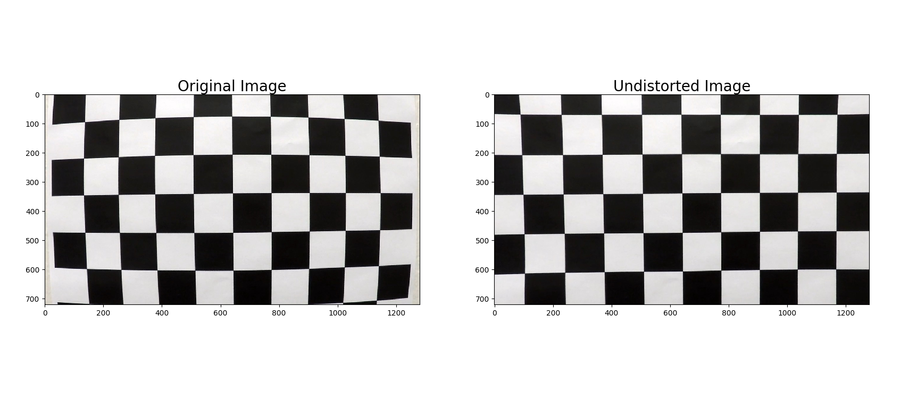
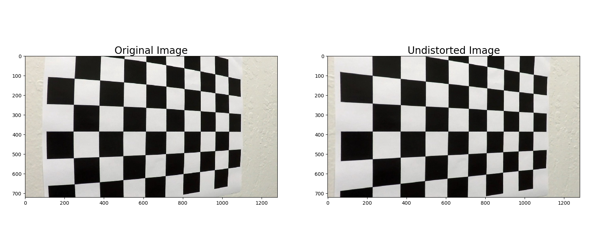
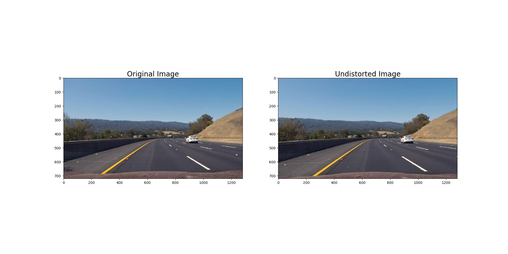

## Advanced Lane Finding

## The Project

The goal of this project is to identify the lane boundaries in a video using computer vision.
The steps of this project are the following:

* Compute the camera calibration matrix and distortion coefficients given a set of chessboard images.
* Apply a distortion correction to raw images.
* Use color transforms, gradients, etc., to create a thresholded binary image.
* Apply a perspective transform to rectify binary image ("birds-eye view").
* Detect lane pixels and fit to find the lane boundary.
* Determine the curvature of the lane and vehicle position with respect to center.
* Warp the detected lane boundaries back onto the original image.
* Output visual display of the lane boundaries and numerical estimation of lane curvature and vehicle position.

The images for camera calibration are stored in the folder called `camera_cal`.  The images in `test_images` are for testing the pipeline on single frames.  If you want to extract more test images from the videos, you can simply use an image writing method like `cv2.imwrite()`, i.e., you can read the video in frame by frame as usual, and for frames you want to save for later you can write to an image file.  

I saved the examples of the output from each stage of my pipeline in the folder called `output_images`, and included a description in my writeup for the project of what each image shows.    The video called `project_video.mp4` is the first video which my pipeline works well on it.  

The `challenge_video.mp4` video is an extra challenge which I tested on my pipeline under somewhat trickier conditions. My proposed pipline works on it, too. 

## Dependencies

* Python 3.5
* Numpy
* OpenCV-Python
* Matplotlib
* Pickle

## How to run
Run `python line_fit_video.py`. This will take the raw video file at 'project_video.mp4', and create an annotated output video at 'out.mp4'. Afterwards, it will display an example annotated image on screen.
Please fell free to use your own vide instead of 'project_video.mp4' and check the output and save it with your own name if you like it.

## Camera calibration
The camera was calibrated using the chessboard images in 'camera_cal/*.jpg'. The following steps were performed for each calibration image:

* Convert to grayscale
* Find chessboard corners with OpenCV's `findChessboardCorners()` function, assuming a 9x6 board

After the above steps were executed for all calibration images, I used OpenCV's `calibrateCamera()` function to calculate the distortion matrices. Using the distortion matrices, I undistort images using OpenCV's `undistort()` function.

The following figures show two examples of undistorting image using camera calibration:

The final calibration matrices are saved in the pickle file 'calibrate_camera.p'

## Advanced Lane Detection Pipeline
The following describes and illustrates the steps involved in the advanced lane detection pipeline. I will use this image as an input for my pipeline and I refer it as INPUT for simplicity:

### Undistort image
Using the camera calibration matrices in 'calibrate_camera.p', we can undistort the input image. Below is the undistorted image of INPUT:

The code to perform camera calibration is in 'calibrate_camera.py'. For all images in 'test_images/\*.jpg', the undistorted version of that image is saved in 'output_images/02ـundistort_\*.png'.

### Thresholded binary image
The next step is to create a thresholded binary image, taking the undistorted image as input. The goal is to identify pixels that are likely to be part of the lane lines. In particular, I perform the following:

* Apply the following filters with thresholding, to create separate "binary images" corresponding to each individual filter
  * Absolute horizontal Sobel operator on the image
  * Sobel operator in both horizontal and vertical directions and calculate its magnitude
  * Sobel operator to calculate the direction of the gradient
  * Convert the image from RGB space to HLS space, and threshold the S channel
  * Convert the image from RGB space to HSV space, and threshold the H, S, and V channels
  * Convert the image from RGB space to Gray space, and threshold its magnitude.
  
* Combine the above binary images to create the final binary image

Here is the example image, transformed into a binary image by combining the above thresholded binary filters:

The code to generate the thresholded binary image is in 'combined_thresh.py', in particular the function `combined_thresh()`. For all images in 'test_images/\*.jpg', the thresholded binary version of that image is saved in 'output_images/binary_\*.png'.

Referencing The Project
---
If you like my code and you want to use it in your project, please refer it like this:

`Amani, Sajjad. "Advanced Lane Finding on the Road." GitHub, 16 July 2019, https://github.com/Sj-Amani/LaneLines_AdvancedDetector`

